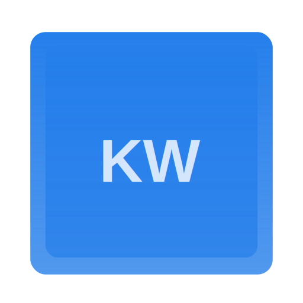

# KeyWiz

## Overview

KeyWiz is a sleek, always-on-top Windows application that dynamically displays keyboard shortcuts for your currently active application. Perfect for developers, power users, and anyone looking to boost their productivity!

## Features

- **Dynamic Shortcut Detection**: Automatically updates shortcuts based on the active application
- **Minimal UI**: Thin sidebar design that doesn't interrupt your workflow
- **Windows Snap Support**: Seamlessly integrates with Windows window management
- **Custom Positioning**: Toggle between left and right screen sides
- **Modern, Frameless Design**: Blends perfectly with your desktop environment

## Screenshots

[Insert screenshots of the app in different states]

## Installation

### Prerequisites

- Windows 10/11
- Python 3.8+
- pip package manager

### Setup

1. Clone the repository:
   ```bash
   git clone https://github.com/yourusername/keywiz.git
   cd keywiz
   ```

2. Install required dependencies:
   ```bash
   pip install -r requirements.txt
   ```

3. Run the application:
   ```bash
   python keywiz_app.py
   ```

## Dependencies

- PyQt5
- psutil
- win32gui
- win32process
- markdown2

## Contributing

Contributions are welcome! Here's how you can help:

1. Fork the repository
2. Create your feature branch (`git checkout -b feature/AmazingFeature`)
3. Commit your changes (`git commit -m 'Add some AmazingFeature'`)
4. Push to the branch (`git push origin feature/AmazingFeature`)
5. Open a Pull Request

### Adding Shortcuts

To add shortcuts for an application:

1. Create a new markdown file in the `shortcuts/` directory
2. Name the file `[application_name].md`
3. Format shortcuts using markdown

Example `vscode.md`:
```markdown
# Visual Studio Code Shortcuts

## File Operations
- `Ctrl+N`: New File
- `Ctrl+S`: Save
- `Ctrl+Shift+S`: Save All

## Editing
- `Ctrl+Z`: Undo
- `Ctrl+Y`: Redo
```

## Customization

Edit `keywiz_app.py` to modify:
- Window size
- Color scheme
- Positioning behavior

## License

Distributed under the MIT License. See `LICENSE` for more information.

## Acknowledgments

- Inspired by productivity tools and developer workflows
- Built with  using Python and PyQt5

## Contact

Your Name - [your.email@example.com](mailto:your.email@example.com)

Project Link: [https://github.com/yourusername/keywiz](https://github.com/yourusername/keywiz)
